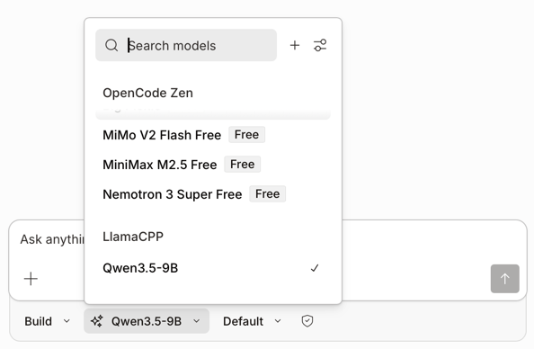

# OpenCode setup and test

## OpenCode Desktop
1. Install [OpenCode Desktop](https://opencode.ai/download).
> It is in (Beta) at time of writing and somewhat buggy.
> Install this anyway, it makes setting up local LLM easier.

2. Find any repository as a playground.
> For example `https://github.com/karpathy/autoresearch`

3. Run OpenCode Desktop. Click on the Settings cog on bottom right.
4. Under `Server` > `Providers`, scroll to the bottom to find **Custom provider**. Click `+ Connect`

5. Enter these details as below:
   - Provider ID: local-llamacpp
   - Display name: LlamaCPP
   - Base URL: http://localhost:8001
   - Models
     - model-id: qwen3.5-35B
     - Display Name: Qwen3.5-35B

6. Click **Submit**
7. Click the `+` button on the top left to select the repository to explore
8. Click `New session`
9. Near the bottom below the chat box, change the model by clicking the middle dropdown. 
It will be pre-selected to the free model available. Change it to Qwen3.5-34B that we've just set up.

> Careful about using the Free models. They are free to use, but they're 'using this time to collect feedback and improve the model.'
> See https://opencode.ai/docs/zen/#pricing for more.
10. Start chatting! Ask `What is this repository about?`

## OpenCode 
This assumes that your custom provider for LlamaCPP - Qwen3.5-34B has been set up.

1. Install [OpenCode Terminal](https://opencode.ai/download).
2. `cd` to your playground repository.
3. Run `opencode`.
4. `Ctrl + p` for commands.
5. `Switch model` > `Qwen3.5-34B LlamaCPP`. Hit return.
6. Start chatting! Ask `What is this repository about?`